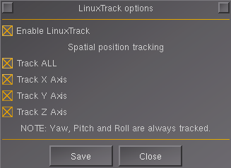

# Add-on usage

Addon enables integration with the LinuxTrack software. 

# LinuxTrack configuration

First configure LinuxTrack with it's GUI configuration. There you can test if
the selected tracking device is working and save the configuration. After that
you can run the PIPE software which feeds the data through UDP protocol. Run it
with `--output-net-udp --format-flightgear` code. Running linuxtrack via helper
script. It should be saved into e.g. run_ltr.sh script. After running it the
tracking device should be turned on.

Example startup code:

```
#!/bin/bash
PATH=/opt/linuxtrack-0.99.18
export LD_LIBRARY_PATH=$LD_LIBRARY_PATH:$PATH/lib/:$PATH/lib/linuxtrack
$PATH/bin/ltr_pipe --output-net-udp --format-flightgear
```

# Recenter

It might be sometimes feasible to recenter the view (e.g. changed default head
position). For this use ltr_recenter application from the LinuxTrack source.

Example recenter code:

```
#!/bin/bash
PATH=/opt/linuxtrack-0.99.18
export LD_LIBRARY_PATH=$LD_LIBRARY_PATH:$PATH/lib/:$PATH/lib/linuxtrack
$PATH/bin/ltr_recenter
```

# Addon configuration

Next start FlightGear. Go to menu `Add-on -> Linux Head Track`. There you can
enable linuxtrack protocol and enable tracking of the selected orientations
(x/y/z) separately. When the tracking is enabled and the LinuxTrack application
(ltr_pipe) is running in the background you should be able to control the view
direction only by your head movement.



Have fun !

