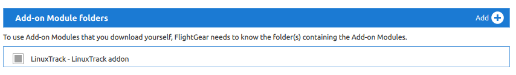

# About

Linuxtrack add-on for FlightGear Flight Simulator. Enables communication with
Linuxtrack software. It is add-on encapsulation for protocol included in the
original software https://github.com/uglyDwarf/linuxtrack/tree/master/doc/fgfs

# Installation

* extract zip (if downloaded as a zip) to a given location. For example let's
  say we have /myfolder/addons/thisaddon with contents of this addon.
* run flightgear with --addon directive **OR** add it in the Launcher application
  in 'Add-On' section and enable it via checkbox near the addon info.

Code:

```
    ./fgbin/bin/fgfs --fg-root=./fgdata --launcher --prop:/sim/fg-home=/myfolder/flightgear/fghome --addon="/myfolder/addons/thisaddon"
```

Addon registration in the Launcher:



# History

* 0.0.1 - first public version on github

# Authors

* uglyDwarf - linuxtrack protocol definition
* Slawek Mikula - source code, addon encapsulation

# Links

* https://github.com/uglyDwarf/linuxtrack - linux head tracking software

# License

GNU General Public License version 2
